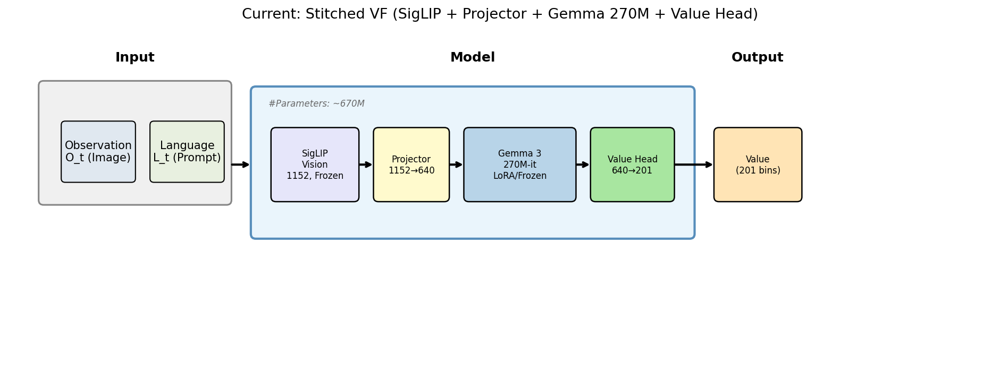
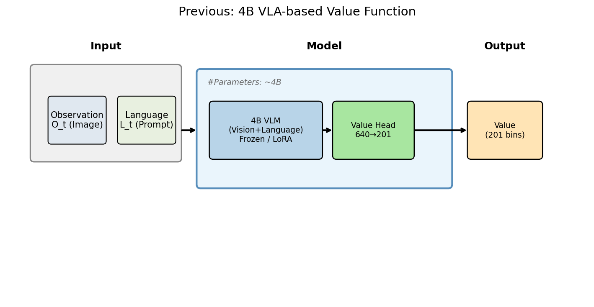
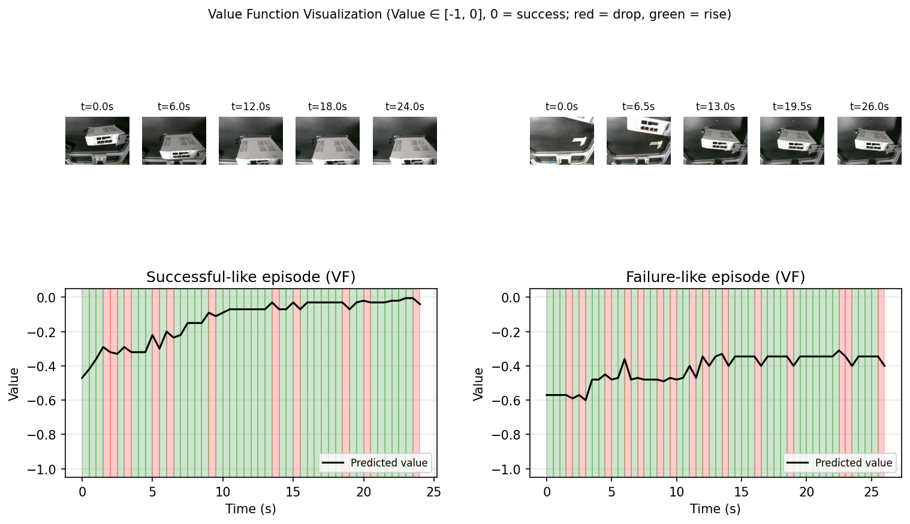

# Value Function for Advantage-Conditioned Policy (π-style Reproduction)

**语言 / Language:** [English](#english) · [中文](#中文)

---

<a name="english"></a>

## English

**Note:** **Pi 0.6** (the original) is **closed source**. This repository is **our own reproduction** of the value-function part: the model (SigLIP + Gemma + Projector + Value head, etc.) is our implementation. **This repo can be published on GitHub for others to see** — we share our code, docs, and results for reference; we do not distribute the original Pi 0.6.

A lightweight **Value Function (VF)** implementation for advantage-conditioned robot policy learning, following the methodology of **Pi** (e.g. π₀.6): train a VF to score trajectories, then use high-advantage (positive) data only for policy fine-tuning.

This repo focuses on the **VF part**: a small multimodal model that predicts a **201-bin discrete value distribution** (time-to-go style) from robot-view images and task instructions. It is designed to work with **LeRobot-style** data and can be used as the critic in a RECAP / Advantage Conditioning pipeline.

### Overview

- **Input**: Robot camera image(s) + task text (e.g. "plug the cable").
- **Output**: A distribution over 201 value bins (normalized time-to-go in `[-1, 0]`).
- **Usage**: After training, the VF scores offline trajectories; trajectories above a threshold are labeled "Advantage: Positive" and used for policy SFT / offline RL.

**Design choices (reproduction-relevant):**

- **Labels**: Value labels are computed with a **Negative Time-to-Go (NTTG)** rule: successful episodes get values from 0 at success backward (e.g. -1, -2, …); failed episodes get a constant low value. Labels are normalized to `[-1, 0]` and discretized into 201 bins.
- **Loss**: Cross-entropy over the 201 bins (distributional value, not regression).
- **Co-training**: To reduce overfitting on small robot data, the VF is optionally co-trained on a small amount of **VQA / image-question data** (e.g. LLaVA-style or VQAv2), so the model keeps both a value head and a language head.

### Architecture (Stitched VF)

We use a **stitched** small-VLM setup (aligned with the paper’s Gemma 270M + SigLIP style):

| Component       | Model                               | Role                | Params  |
|----------------|--------------------------------------|---------------------|--------|
| Vision encoder | SigLIP-SO400M (patch14-384)          | Image features      | ~400M  |
| Projector      | MLP 1152→1152→640                    | Vision–language map | ~1.5M  |
| Language model | Gemma-3-270M-it                      | Causal LM + hidden  | ~270M  |
| Value head     | Linear(640 → 201)                    | Bin distribution    | ~130K  |

**Total ~670M parameters** (much smaller than a 4B VLA-based VF).

- **Stage 1 (alignment)**: Train only the Projector on VQA/image-caption data (e.g. LLaVA-Instruct or The Cauldron VQAv2); SigLIP and Gemma are frozen.
- **Stage 2 (robot VF)**: Load the Stage-1 projector; train Projector + Value head + optional **LoRA** on Gemma, on robot data with 201-bin labels. Data split: **8 : 1 : 1** (train / val / test) by episode.

**Current stitched VF (SigLIP + Projector + Gemma 270M + Value head):**



**Previous 4B VLA-based VF (for comparison):**



### Repository structure

```
value_function_stitched/
├── README.md                    # This file
├── FILE_MANIFEST.md             # List of repository contents
├── model_stitched.py            # Stitched VF model (SigLIP + Projector + Gemma + Value head)
├── dataset_alignment.py         # Stage 1: VQA / image-caption dataloader
├── dataset_robot.py             # Stage 2: Robot parquet + video dataloader (LeRobot-style)
├── train_alignment.py          # Stage 1 training (projector only)
├── train_robot_vf.py           # Stage 2 training (projector + value head + optional LoRA)
├── train.py                    # Unified entry: stage 1, stage 2, or both
├── eval_test.py                # Test-set evaluation (loss, Top-1, Top-5)
├── visualize_value_function.py # Value-over-time visualization (e.g. paper-style curves)
├── draw_architectures.py       # Script to draw architecture diagrams
├── start_train_tmux.sh         # Example: run stage 2 in tmux (paths are placeholders)
├── architecture_current_stitched.png
├── architecture_prev_4b_vla.png
├── value_function_visualization.png   # Example value curve (optional)
├── TRAINING.md                 # Training guide (8:1:1 split, tmux, GPU tips)
└── RESULTS.md                  # Validation/test metrics
```

**Not included in this repository:**

- Robot or real-world **datasets** (videos, parquet, raw logs). Only code and data loaders are provided; paths in docs/scripts are placeholders.
- Large **checkpoints** (e.g. `outputs/`, `*.pt`, `*.safetensors`). See FILE_MANIFEST for details.
- **Logs** with internal paths or sensitive info.

See **FILE_MANIFEST.md** for the full list of contents.

### Data

Training and evaluation expect **LeRobot-style** data:

- **Parquet**: Episodes with frame indices, value labels (raw float from NTTG), task text, video keys.
- **Videos**: Frames referenced by the parquet (paths are configured via `--parquet_dir` and `--video_root`).

Value labels are assumed to be precomputed (e.g. by a separate `process_data` pipeline) with NTTG and optionally normalized to `[-1, 0]`; the dataloader maps them to 201-bin indices. **This repository does not include any dataset**; only the data *format* and *loading code* are provided.

### Quick start

**Environment:** Python 3.10+, PyTorch, Hugging Face `transformers`, `datasets`, and dependencies for SigLIP/Gemma. Use a venv or conda as usual.

**1. Stage 1 — Alignment (VQA)**

```bash
python train.py --stage 1 \
  --output_base ./outputs
# Or: python train_alignment.py --dataset_name HuggingFaceM4/the_cauldron --cauldron_subset vqav2 ...
```

**2. Stage 2 — Robot value function**

Replace the placeholder paths with your parquet directory and video root:

```bash
python train.py --stage 2 \
  --projector_path ./outputs_alignment/best_projector.pt \
  --parquet_dir /path/to/your/lerobot_parquet/chunk-000 \
  --video_root /path/to/your/videos \
  --output_base ./outputs \
  --train_ratio 0.8 --val_ratio 0.1 --test_ratio 0.1 --split_seed 42
```

**3. Run in tmux (recommended)**

Edit `start_train_tmux.sh` to set `CUDA_VISIBLE_DEVICES`, `parquet_dir`, and `video_root`, then:

```bash
chmod +x start_train_tmux.sh && ./start_train_tmux.sh
```

**4. Test-set evaluation**

```bash
python eval_test.py \
  --checkpoint ./outputs/robot_vf \
  --parquet_dir /path/to/your/lerobot_parquet/chunk-000 \
  --video_root /path/to/your/videos \
  --train_ratio 0.8 --val_ratio 0.1 --test_ratio 0.1 --split_seed 42
```

Use the same split seed as training so the test set is consistent. For accurate metrics, evaluate with `frame_skip=1` (no frame skipping) on the test set.

### Results (example)

On an internal robot dataset (not included), with 8:1:1 split and best checkpoint selected by **validation loss**:

- **Test loss**: ~4.07 (cross-entropy over 201 bins).
- **Test Top-1**: ~4.1%; **Test Top-5**: ~19.2%.

Random guess baseline: Top-1 ≈ 1/201 ≈ 0.5%, so the stitched VF clearly learns above chance. For more detail and epoch-by-epoch validation curves, see **RESULTS.md** (no internal paths or raw data).

**Example: value over time (test episode):**



### References and acknowledgments

- **Pi (π) 0.6** is **closed source** (the original is not open). RECAP / Advantage Conditioning: value functions for filtering high-advantage data and conditioning the policy.
- **OpenVLA**: open-weight VLA; the full Pi 0.6 pipeline is closed source. This repo implements the VF part as **our own reproduction**, shared publicly for reference.
- **SigLIP**, **Gemma**: vision and language models (Hugging Face); used here as components in our implementation.

This project is our **reproduction** of the value-function part; the full system (policy + simulation/real robot) is not included. **This repository can be published on GitHub** so others can view the approach, code, and results. Robot and real-world data are not distributed.

### License

This project is shared for reference and learning. Base components (SigLIP, Gemma) have their own licenses; see your institution’s policy for use and redistribution.

---

<a name="中文"></a>

## 中文

**说明：** **π₀.6**（官方）为 **闭源**。本仓库为其价值函数部分的 **我们自行复现**：模型（SigLIP、Gemma、Projector、Value head 等）为我们实现。**本仓库可以公开发布在 GitHub 上供他人查看** — 我们分享代码、文档与结果供参考，不分发 π₀.6 官方实现。

本仓库为 **优势条件策略**（如 π₀.6）所用的轻量级 **价值函数 (VF)** 实现：先训练 VF 对轨迹打分，再仅用高优势（正样本）数据做策略微调。

本仓库仅包含 **VF 部分**：一个小型多模态模型，根据机器人视角图像和任务指令预测 **201-bin 离散价值分布**（time-to-go 风格）。数据格式兼容 **LeRobot**，可作为 RECAP / 优势条件流程中的“裁判”模型使用。

### 概述

- **输入**：机器人摄像头图像 + 任务文本（如「插线」）。
- **输出**：201 个价值 bin 的概率分布（归一化到 `[-1, 0]` 的 time-to-go）。
- **用途**：训练完成后用 VF 给离线轨迹打分，高于阈值的轨迹标记为「Advantage: Positive」，用于策略 SFT / 离线强化学习。

**设计要点（复现相关）：**

- **标签**：采用 **负向剩余步数 (NTTG)** 规则：成功片段从成功时刻向前倒推赋值为 0、-1、-2…；失败片段统一赋低分。标签归一化到 `[-1, 0]` 后离散为 201 个 bin。
- **损失**：对 201 个 bin 做交叉熵（分布化价值，非回归）。
- **协同训练**：为减轻小规模机器人数据过拟合，可加入少量 **VQA / 图文问答数据**（如 LLaVA-Instruct 或 VQAv2）做协同训练，使模型同时保留价值头与语言头。

### 架构（缝合式 VF）

采用 **缝合式** 小 VLM（与论文中 Gemma 270M + SigLIP 思路一致）：

| 组件         | 模型                               | 作用           | 参数量   |
|--------------|------------------------------------|----------------|----------|
| 视觉编码器   | SigLIP-SO400M (patch14-384)        | 图像特征       | ~400M    |
| Projector    | MLP 1152→1152→640                  | 视觉–语言对齐  | ~1.5M    |
| 语言模型     | Gemma-3-270M-it                    | 因果 LM + 隐层 | ~270M    |
| Value Head   | Linear(640 → 201)                  | bin 分布       | ~130K    |

**总参数量约 670M**（远小于 4B 的 VLA 版 VF）。

- **阶段 1（对齐）**：仅训练 Projector，使用 VQA/图文描述数据（如 LLaVA-Instruct 或 The Cauldron VQAv2）；SigLIP 与 Gemma 冻结。
- **阶段 2（机器人 VF）**：加载阶段 1 的 Projector，在机器人数据上训练 Projector + Value head + 可选 **LoRA**，标签为 201-bin。数据按 episode **8 : 1 : 1**（训练 / 验证 / 测试）划分。

**当前缝合式 VF（SigLIP + Projector + Gemma 270M + Value head）：**


**此前 4B VLA 版 VF（对比用）：**


### 仓库结构

```
value_function_stitched/
├── README.md                    # 本文件（中英双语）
├── FILE_MANIFEST.md             # 仓库内容清单
├── model_stitched.py            # 缝合式 VF 模型定义
├── dataset_alignment.py        # 阶段 1：VQA / 图文 dataloader
├── dataset_robot.py             # 阶段 2：机器人 parquet + 视频 dataloader（LeRobot 格式）
├── train_alignment.py           # 阶段 1 训练脚本
├── train_robot_vf.py            # 阶段 2 训练脚本（Projector + Value head + 可选 LoRA）
├── train.py                     # 统一入口：阶段 1 / 2 / 两阶段连跑
├── eval_test.py                 # 测试集评估（loss、Top-1、Top-5）
├── visualize_value_function.py  # 价值随时间可视化（如论文风格曲线）
├── draw_architectures.py        # 架构图绘制脚本
├── start_train_tmux.sh          # 示例：在 tmux 中跑阶段 2（路径为占位）
├── architecture_current_stitched.png
├── architecture_prev_4b_vla.png
├── value_function_visualization.png   # 示例价值曲线（可选）
├── TRAINING.md                  # 训练说明（8:1:1 划分、tmux、GPU 建议）
└── RESULTS.md                   # 验证/测试指标
```

**不随本仓库提供：**

- 机器人或真实场景 **数据集**（视频、parquet、原始日志）。仅提供代码与数据加载逻辑；文档/脚本中的路径均为占位。
- 大型 **检查点**（如 `outputs/`、`*.pt`、`*.safetensors`）。详见 FILE_MANIFEST。
- 含内部路径或敏感信息的 **日志**。

详见 **FILE_MANIFEST.md** 中的完整内容列表。

### 数据

训练与评估需要 **LeRobot 风格** 数据：

- **Parquet**：episode、帧索引、价值标签（NTTG 原始浮点）、任务文本、视频 key。
- **视频**：parquet 中引用的帧，路径通过 `--parquet_dir` 与 `--video_root` 配置。

价值标签需预先用 NTTG 算好（可由单独的 `process_data` 流程生成），并可选归一化到 `[-1, 0]`；dataloader 会映射到 201-bin 索引。**本仓库不包含任何数据集**，仅提供数据格式说明与加载代码。

### 快速开始

**环境**：Python 3.10+、PyTorch、Hugging Face `transformers` / `datasets`，以及 SigLIP/Gemma 所需依赖。建议使用 venv 或 conda。

**1. 阶段 1 — 对齐（VQA）**

```bash
python train.py --stage 1 \
  --output_base ./outputs
# 或：python train_alignment.py --dataset_name HuggingFaceM4/the_cauldron --cauldron_subset vqav2 ...
```

**2. 阶段 2 — 机器人价值函数**

将占位路径替换为自己的 parquet 目录与视频根目录：

```bash
python train.py --stage 2 \
  --projector_path ./outputs_alignment/best_projector.pt \
  --parquet_dir /path/to/your/lerobot_parquet/chunk-000 \
  --video_root /path/to/your/videos \
  --output_base ./outputs \
  --train_ratio 0.8 --val_ratio 0.1 --test_ratio 0.1 --split_seed 42
```

**3. 在 tmux 中运行（推荐）**

编辑 `start_train_tmux.sh`，设置 `CUDA_VISIBLE_DEVICES`、`parquet_dir`、`video_root`，然后：

```bash
chmod +x start_train_tmux.sh && ./start_train_tmux.sh
```

**4. 测试集评估**

```bash
python eval_test.py \
  --checkpoint ./outputs/robot_vf \
  --parquet_dir /path/to/your/lerobot_parquet/chunk-000 \
  --video_root /path/to/your/videos \
  --train_ratio 0.8 --val_ratio 0.1 --test_ratio 0.1 --split_seed 42
```

需与训练使用相同 `split_seed` 以保持测试集一致。为得到更准确的指标，建议在测试集上使用 `frame_skip=1`（不跳帧）。

### 结果（示例）

在内部机器人数据集（未随仓库提供）上，8:1:1 划分，按 **验证 loss** 选 best 检查点：

- **Test loss**：约 4.07（201-bin 交叉熵）。
- **Test Top-1**：约 4.1%；**Test Top-5**：约 19.2%。

随机猜测基线 Top-1 ≈ 1/201 ≈ 0.5%，缝合式 VF 明显优于随机。更详细的逐轮验证曲线见 **RESULTS.md**（无内部路径或原始数据）。

**示例：价值随时间变化（测试 episode）：**


### 参考文献与致谢

- **Pi (π) 0.6** 为 **闭源**（官方未开源）。RECAP / 优势条件：用价值函数筛选高优势数据并条件化策略。
- **OpenVLA**：开源 VLA；完整 π₀.6 流程为闭源。本仓库实现 VF 部分，为 **我们自行复现**，公开分享供参考。
- **SigLIP**、**Gemma**：视觉与语言模型（Hugging Face）；在本实现中作为组件使用。

本项目为我们 **复现** 的价值函数部分；完整系统（策略 + 仿真/真机）不在此仓库。**本仓库可以发布在 GitHub 上**，供他人查看方法、代码与结果。机器人及真实场景数据不随仓库提供。

### 许可

本项目供参考与学习使用。基础组件（SigLIP、Gemma）各有其许可；使用与再分发请遵守所属机构规定。
